# 📦 Online Retail — Predicción de Recompra de Clientes


## 1. 📌 Descripción del proyecto

Este proyecto desarrolla un modelo de Machine Learning para predecir la probabilidad de recompra de clientes en un negocio de retail online, utilizando el dataset Online Retail II.

El objetivo principal es identificar clientes con alta probabilidad de volver a comprar, permitiendo:

- Optimizar campañas de fidelización
- Priorizar acciones comerciales
- Reducir churn
- Incrementar el Customer Lifetime Value (CLV)
- Mejorar la eficiencia del marketing

El proyecto cubre todo el pipeline de ciencia de datos:

- Limpieza y preparación de datos
- Feature engineering (RFM + variables adicionales)
- Validación temporal
- Modelado y comparación de algoritmos
- Optimización de hiperparámetros con Optuna
- Explicabilidad con DALEX
- Evaluación de negocio

## 2. 📂 Dataset

El dataset contiene transacciones históricas de una empresa de retail online entre **2009 y 2011**. Cada registro representa una línea de factura con información sobre:

- Producto
- Cantidad
- Precio
- Fecha de compra
- País
- Cliente

## 🎯 Variable objetivo

`is_rebuyer` Variable binaria que representa:

- 1 → el cliente vuelve a comprar después de la fecha de corte
- 0 → el cliente no vuelve a comprar

Tasa de recompra observada: 52.75%

## 3. 🧹 Data Cleaning

Objetivo: Depurar el dataset para garantizar calidad y consistencia.

Acciones realizadas: 

- Eliminación de duplicados
- Eliminación de facturas canceladas
- Filtrado de cantidades y precios inválidos
- Normalización de columnas
- Conversión de tipos
- Optimización de memoria

📊 Visualizaciones

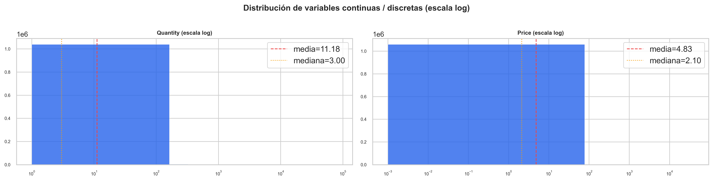

Estas distribuciones muestran cómo se comportan las variables `Quantity` y `Price` después de aplicar una transformación logarítmica.  
La escala log permite visualizar mejor valores muy dispersos y detectar patrones que en escala lineal quedarían ocultos.

- **Quantity** presenta una fuerte asimetría a la derecha: la mayoría de las transacciones tienen cantidades pequeñas, mientras que pocas observaciones alcanzan valores muy altos.  
- **Price** también muestra una distribución sesgada, con precios bajos muy frecuentes y valores altos poco comunes.  
- La diferencia entre **media** y **mediana** en ambas variables confirma la presencia de colas largas y outliers.

Este análisis justifica el uso de transformaciones logarítmicas y técnicas robustas para el modelado.

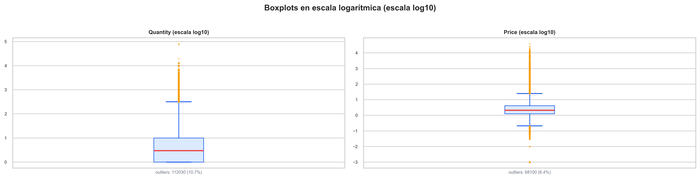

Los boxplots en escala log10 permiten identificar la presencia y magnitud de outliers en `Quantity` y `Price`.

- En **Quantity**, aproximadamente el 10.7% de los valores son outliers, lo que indica una alta variabilidad en las cantidades compradas por transacción.  
- En **Price**, los outliers representan el 6.4%, mostrando que aunque existen precios extremos, su proporción es menor que en Quantity.

Estos resultados refuerzan la necesidad de aplicar transformaciones, winsorización o técnicas robustas para evitar que valores extremos distorsionen el modelo.

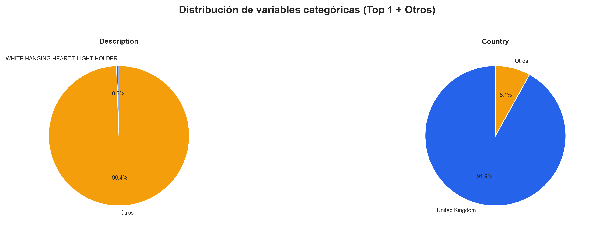

Este análisis resume la concentración de categorías en variables categóricas clave.

- En **Description**, el producto más frecuente representa solo el 0.6% del total, lo que evidencia una alta diversidad de artículos y una distribución extremadamente dispersa.  
- En **Country**, el 91.9% de las transacciones provienen del **United Kingdom**, lo que confirma que el negocio está fuertemente concentrado en un solo mercado.

Esta información es útil para decidir si conviene agrupar categorías, generar dummies o aplicar técnicas de reducción de dimensionalidad.


## 4. 🧪 Exploratory Data Analysis (EDA)

Objetivo: Comprender patrones de compra, comportamiento del cliente y relaciones entre variables.

Para mejorar el análisis exploratorio y comprender mejor el comportamiento de compra del cliente, se derivaron varias variables temporales y transaccionales de la fecha de transacción original (`InvoiceDate`).

Estas nuevas variables permiten analizar:

- Patrones de compra estacionales.
- Actividad del cliente por día de la semana y hora del día.
- Evolución de las ventas a lo largo del tiempo.
- Comportamiento de generación de ingresos.

Además, se creó la variable (`Revenue`) como producto de la cantidad y el precio unitario, que representa el valor monetario de cada transacción.

Hallazgos clave:

- Distribuciones altamente sesgadas → necesidad de escala log
- Outliers significativos en Quantity y Price
- Fuerte concentración geográfica en UK
- Correlación positiva entre Quantity y Revenue
- Correlación negativa entre Price y Quantity
  
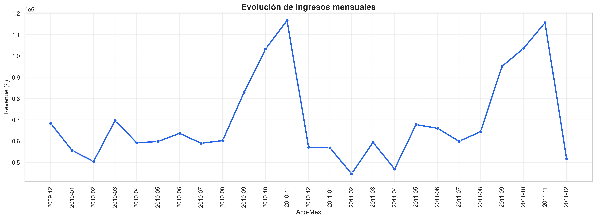

La evolución de los ingresos mensuales muestra un claro comportamiento de compra estacional durante el período analizado. Los picos significativos en la actividad de ventas sugieren la existencia de períodos comerciales fuertes, probablemente asociados con días festivos y campañas de fin de año.

Esta variabilidad temporal indica que el comportamiento de compra del cliente no es constante a lo largo del tiempo, lo que refuerza la importancia de incorporar variables de frecuencia y actualidad en el modelo predictivo.

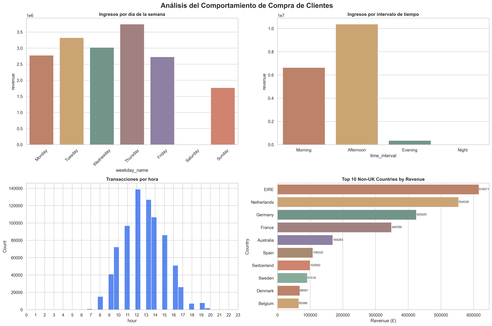

### Ingresos por día de la semana

La distribución de los ingresos entre los días de la semana revela patrones de concentración de compras durante la semana laboral. Este comportamiento puede indicar la presencia de clientes B2B o ciclos de compra operativos asociados a los días laborables.

### Ingresos por intervalo de tiempo

La mayoría de las transacciones se producen durante la mañana y la tarde, lo que sugiere que la actividad de los clientes se concentra principalmente en el horario comercial habitual.


### Transacciones por hora

La distribución horaria de las transacciones destaca los periodos de mayor actividad comercial a lo largo del día. Comprender estos picos operativos puede ayudar a optimizar las campañas de marketing y las estrategias de interacción con el cliente.


### Principales países por ingresos

El Reino Unido domina de forma abrumadora la generación total de ingresos. Para comprender mejor el comportamiento de los clientes internacionales, el análisis excluye las transacciones en el Reino Unido y se centra en los principales mercados fuera de este país con la idea de influir en las estrategias de fidelización de clientes y en el comportamiento de compra para el resto de mercado.

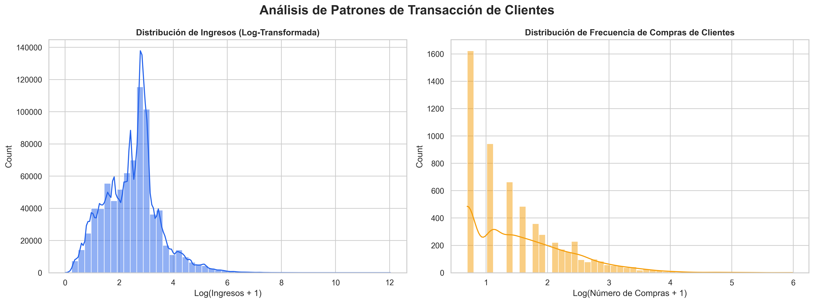

### Distribución de ingresos

La distribución de ingresos presenta una marcada asimetría positiva, lo que indica la presencia de un número reducido de transacciones de gran volumen y numerosas compras de bajo valor. Este comportamiento es común en el sector minorista y sugiere la necesidad de realizar transformaciones logarítmicas durante el modelado.


### Frecuencia de compra del cliente

La frecuencia de compra del cliente muestra que la mayoría de los clientes realizan relativamente pocas compras, mientras que un grupo menor presenta un comportamiento de compra recurrente significativo. Este desequilibrio respalda la relevancia de desarrollar un modelo de predicción de recompra del cliente.

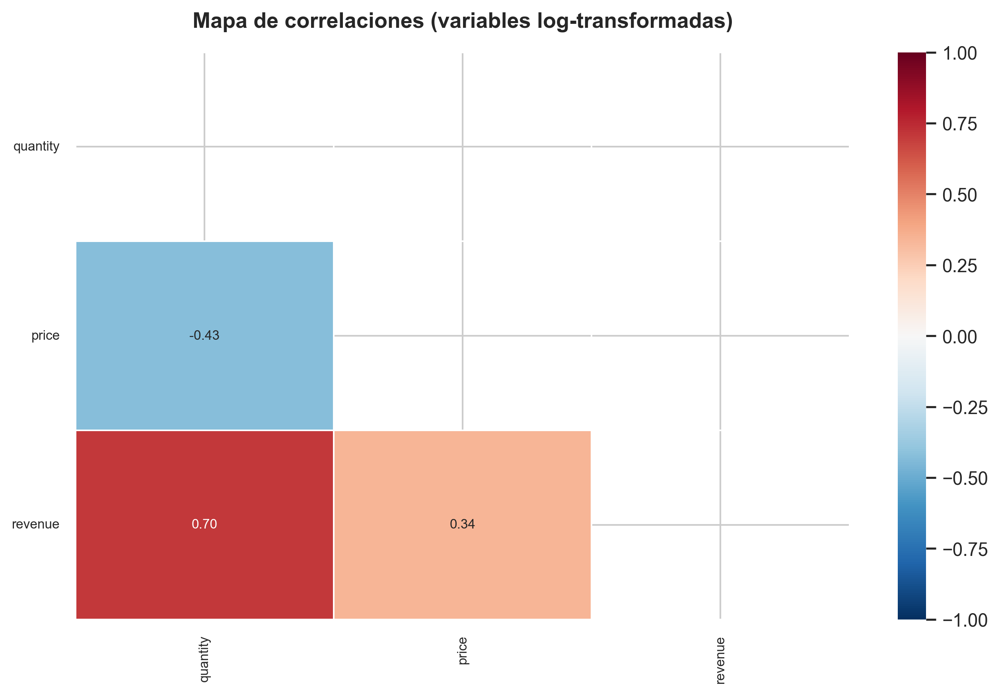

El mapa de calor muestra las correlaciones entre `Quantity`, `Price` y `Revenue` después de aplicar transformaciones logarítmicas.

- **Quantity y Revenue** presentan una correlación positiva fuerte (0.70), lo cual es esperable ya que el ingreso depende directamente de la cantidad vendida.  
- **Price y Revenue** tienen una correlación moderada (0.34), indicando que el precio influye, pero en menor medida que la cantidad.  
- **Quantity y Price** muestran una correlación negativa (-0.43), lo que sugiere que productos más baratos tienden a venderse en mayores cantidades.

Este análisis ayuda a entender la estructura del negocio y a anticipar qué variables podrían tener mayor impacto en el modelo.

## 5.🏗️ Feature Engineering

Variables generadas:

- RFM: recency, frequency, monetary
- Ticket medio
- Productos únicos
- Cantidad total
- Tenencia del cliente
- Días promedio entre compras
- País (Top 5 + Otros)
- Variables temporales

## 6. 🎯 Target Construction

Validación temporal: 

Fecha de corte: 2011-06-01

La variable objetivo se construyó utilizando las transacciones futuras de los clientes ocurridas después de la fecha límite. Esta configuración de aprendizaje supervisado permite que el modelo aprenda patrones de comportamiento históricos asociados con la probabilidad de recompra futura.

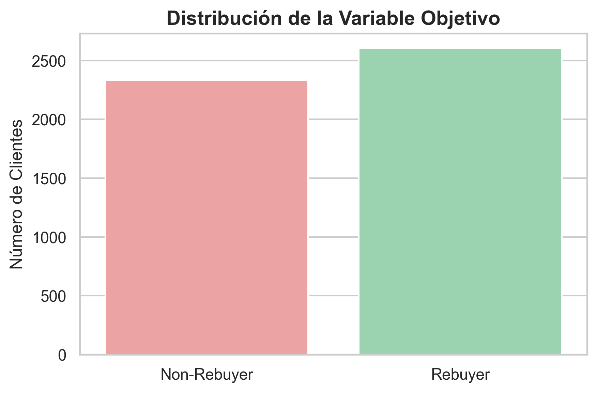

La variable objetivo muestra una distribución relativamente equilibrada:

- **Rebuyer**: clientes que realizaron al menos una recompra.  
- **Non-Rebuyer**: clientes que no volvieron a comprar.

Aunque existe una ligera mayoría de clientes que recompran, la distribución es lo suficientemente balanceada como para no requerir técnicas agresivas de resampling.  
Este equilibrio facilita el entrenamiento de modelos de clasificación sin introducir sesgos significativos.


## 7. 🤖 Modelado Predictivo

Se entrenaron y compararon tres modelos:

- Logistic Regression
- Random Forest
- XGBoost

### Resultados

| Modelo | AUC | Accuracy | Precision | Recall |
|--------|-----|----------|-----------|--------|
| Logistic Regression | 0.792620 | 0.717325 | 0.741036 | 0.714012 |
| Random Forest | 0.778451 | 0.704154 | 0.720617 | 0.717850 |
| XGBoost | 0.777442 | 0.696049 | 0.724138 | 0.685221 |

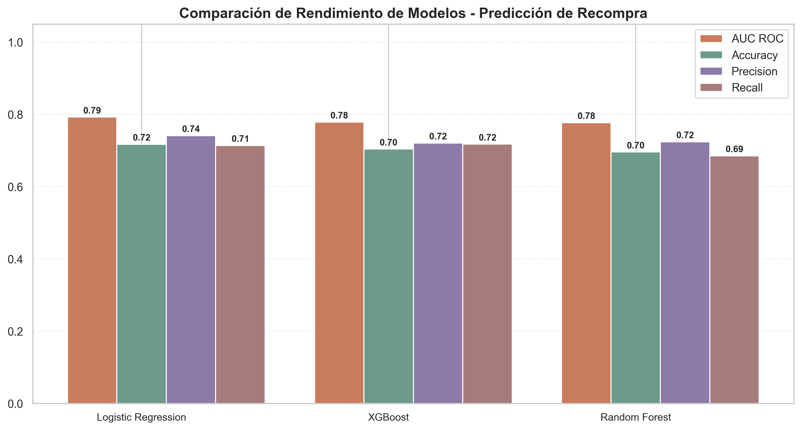

Este gráfico compara el desempeño de Logistic Regression, XGBoost y Random Forest utilizando cuatro métricas clave: AUC ROC, Accuracy, Precision y Recall.

- **Logistic Regression** obtiene el mejor AUC (0.79) y la mayor precisión, mostrando un equilibrio sólido entre sensibilidad y especificidad.  
- **XGBoost** y **Random Forest** presentan métricas similares entre sí, con un rendimiento ligeramente inferior al modelo lineal.  
- La consistencia entre las métricas indica que no existe sobreajuste significativo y que los modelos capturan patrones reales del comportamiento de recompra.

Este análisis permite seleccionar el modelo más adecuado según los objetivos del negocio: maximizar discriminación (AUC) o priorizar precisión/recall.

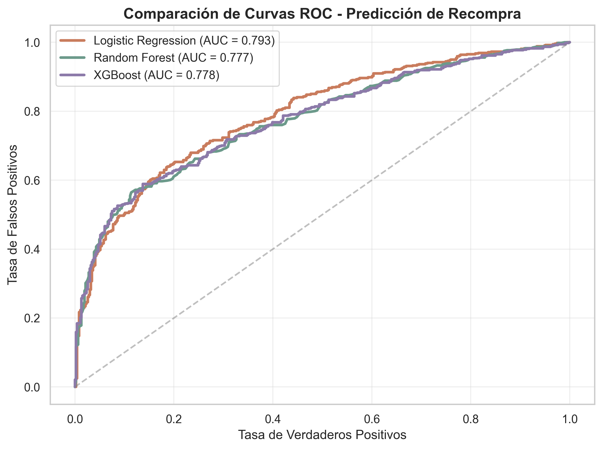

Las curvas ROC permiten evaluar la capacidad de cada modelo para distinguir entre clientes que recompran y los que no.

- **Logistic Regression** muestra la curva más alejada de la diagonal aleatoria, con un AUC de 0.793, lo que indica el mejor desempeño global.  
- **XGBoost** y **Random Forest** presentan curvas muy similares entre sí, con AUC cercanos a 0.78.  
- La diagonal punteada representa un clasificador aleatorio; cuanto más se aleja la curva hacia la esquina superior izquierda, mejor es el modelo.

Este análisis confirma que los tres modelos son útiles, pero Logistic Regression ofrece la mejor capacidad discriminativa.

## 8. 🔍 Optimización de Hiperparámetros (Optuna)

Se utilizó Optuna para maximizar el AUC ROC mediante búsqueda bayesiana. El objetivo de la optimización será maximizar el AUC, ya que es la métrica más adecuada para problemas de clasificación con clases balanceadas o ligeramente desbalanceadas.

Características.

- 50 trials
- Cross-validation
- Espacios de búsqueda específicos por modelo

**Mejores hiperparámetros:** 

| model | n_estimators | learning_rate | max_depth | subsample | colsample_bytree |
|-------|--------------|---------------|-----------|-----------|------------------|
| XGBoost | 286 | 0.01 | 3 | 0.85 | 0.55 |

**Mejor AUC:** 0.81

## 9. 🧠 Explicabilidad del Modelo (DALEX + SHAP)

La explicabilidad es fundamental en proyectos de Machine Learning aplicados al negocio retail, ya que permite:

* **Entender qué impulsa la recompra**

* **Justificar decisiones ante stakeholders**

* **Detectar sesgos o comportamientos inesperados**

* **Aumentar la confianza en el modelo**

Para este proyecto utilizamos DALEX, una librería especializada en explicabilidad global y local.

🔍 Importancia global

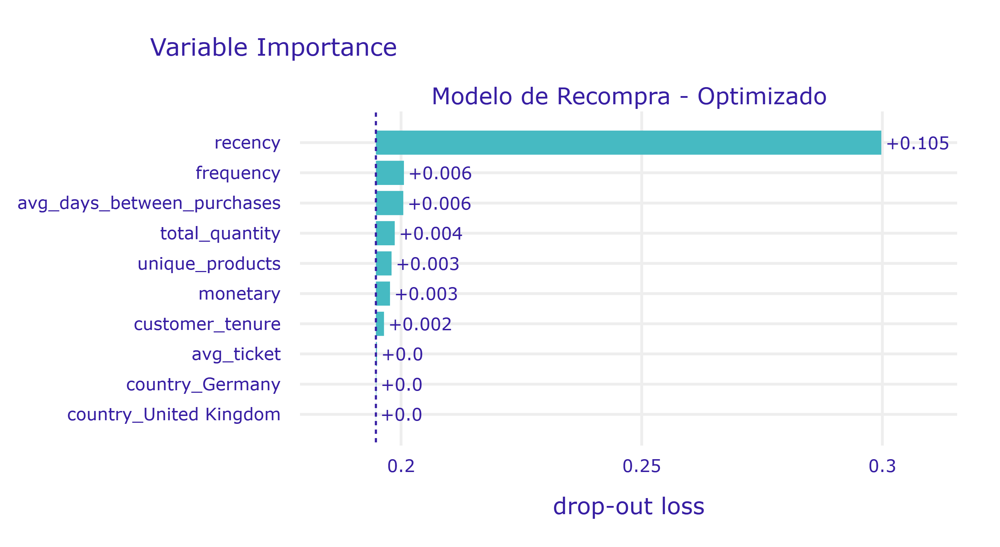

Este gráfico muestra la importancia de cada variable en el modelo optimizado, medida mediante *drop-out loss*.

- **Recency** es, con diferencia, la variable más influyente: cuanto más reciente es la última compra, mayor es la probabilidad de recompra.  
- **Frequency**, **total_quantity** y **avg_days_between_purchases** también aportan información relevante, aunque en menor magnitud.  
- Las variables de país tienen impacto prácticamente nulo, lo que indica que la geografía no es un factor determinante en la recompra dentro de este dataset.

Este análisis ayuda a comprender qué factores impulsan el comportamiento de recompra y facilita la toma de decisiones estratégicas.

📉 Efectos individuales (ALE)

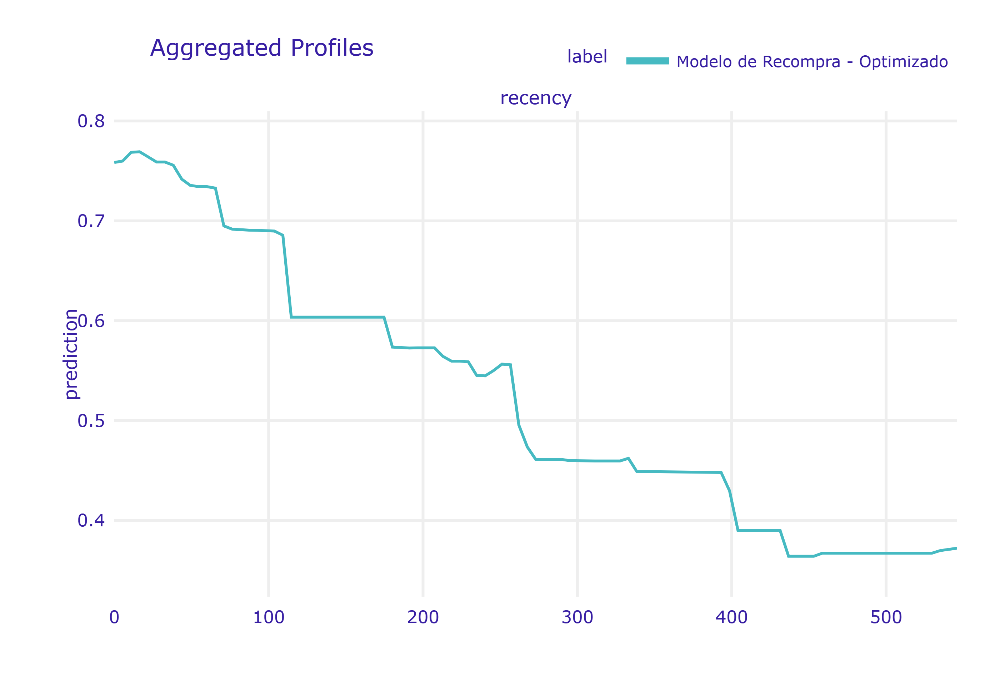

El perfil agregado muestra cómo cambia la predicción del modelo a medida que varía la variable **recency**.

- A valores bajos de recency (última compra reciente), la probabilidad de recompra es alta.  
- A medida que aumenta el número de días desde la última compra, la probabilidad disminuye de forma progresiva.  
- La curva confirma un comportamiento típico en retail: clientes inactivos por largos periodos tienen menor probabilidad de volver a comprar.

Este análisis permite interpretar el modelo de forma intuitiva y validar que su comportamiento es coherente con la lógica del negocio.

🔍 Explicación local (Break Down)

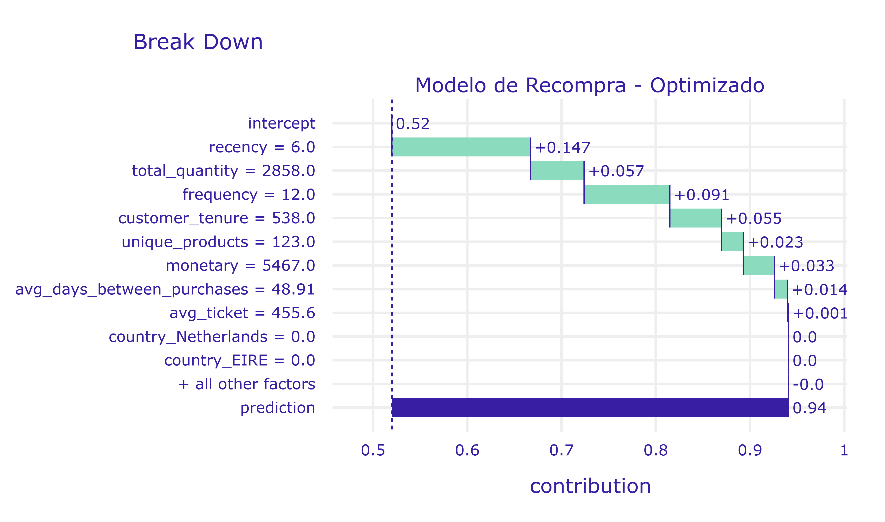

Este gráfico descompone la predicción de un cliente específico, mostrando cómo cada variable contribuye a aumentar o disminuir la probabilidad final de recompra.

- El **intercepto** representa la predicción base del modelo antes de considerar características individuales.  
- Variables como **recency**, **frequency**, **total_quantity** y **monetary** empujan la predicción hacia arriba, indicando señales fuertes de recompra.  
- Algunas variables aportan contribuciones negativas menores, ajustando la predicción final.  
- El resultado final es una probabilidad alta (≈0.90), explicada de manera transparente por los factores del cliente.

Este tipo de análisis es clave para justificar decisiones personalizadas en marketing o CRM.

📉 Distribución de residuos

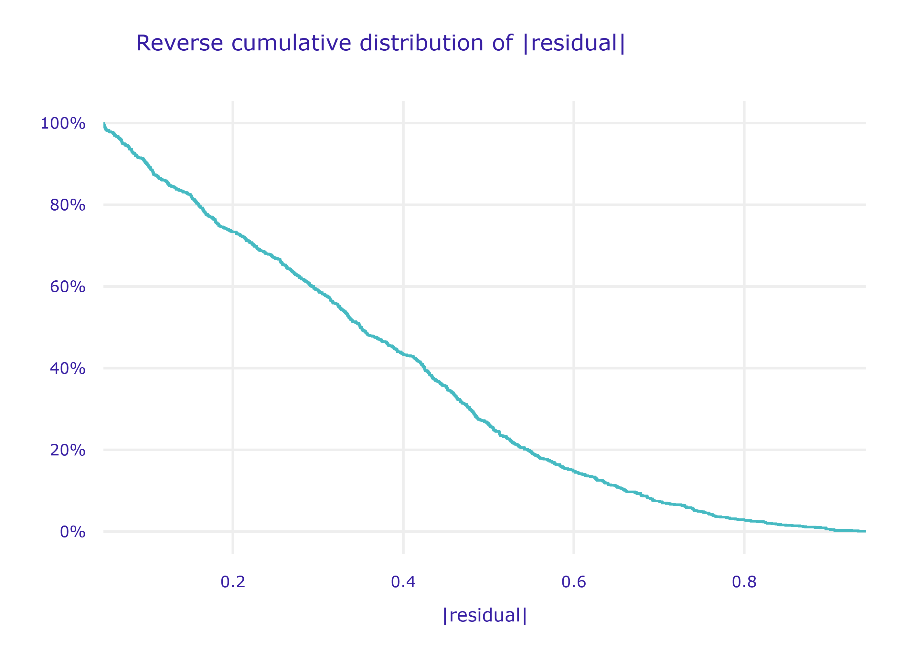

Este gráfico muestra la distribución acumulada inversa de los valores absolutos de los residuos del modelo.

- Un porcentaje alto de observaciones presenta errores pequeños, lo que indica un buen ajuste general.  
- A medida que aumenta el valor del residuo, la proporción de casos que lo superan disminuye rápidamente.  
- La forma suave y decreciente de la curva sugiere que el modelo no presenta errores extremos frecuentes.

Este análisis complementa las métricas tradicionales y permite evaluar la estabilidad del modelo en diferentes rangos de error.

## 10. 🧾 Conclusiones

El modelo logra una capacidad predictiva sólida (AUC ≈ 0.81).

Recency es el factor más determinante en la recompra.

El comportamiento del cliente es altamente no lineal.

Logistic Regression ofrece el mejor equilibrio entre interpretabilidad y rendimiento.

DALEX permite justificar decisiones de marketing basadas en el modelo.

## 11. 🚀 Próximos pasos

Integración del modelo en campañas de marketing automatizadas

Entrenamiento incremental con datos recientes

Inclusión de variables de comportamiento web

Evaluación de uplift modeling para campañas personalizadas

# 📁 Estructura del proyecto
```
.
├── data
│   ├── processed
│   │   └──online_retail.pkl
│   ├── raw
│   │   └──online_retail_II.xlsk
├── notebook
│   └──modelo_fidelizacion_y_recompra.ipynb
├── output
│   ├── raw1_distribucion_variables_continuas_discretas_log.png
│   ├── raw2_boxplots_log.png
│   ├── raw3_distribucion_variables_categoricas_top1_otros.pgn
│   ├── features1_evolucion_ingresos_mensuales.png
│   ├── features2_comportamiento_negocio.png
│   ├── features3_comportamiento_clientes.png
│   ├── features4_correlacion_variables_log.png
│   ├── features5_distribucion_target.png
│   ├── model1_comparacion.png
│   ├── model2_curvas_roc_comparacion.png
│   ├── dalex1_importancia_variables.png
│   ├── dalex2_efectos_individuales_recency.png
│   ├── dalex3_explicacion_local.png
│   └── dalex4_desempeno_modelo.png
├── README.md
└── requirements.txt
```

---

# 🛠️ Tecnologías

- Python
- Pandas & NumPy
- Matplotlib & Seaborn
- Scikit-Learn
- Statsmodels
- SciPy
- XGBoost
- Optuna
- DALEX

---

# ⭐ Key Takeaway

> Entender los datos es más importante que aplicar algoritmos complejos sin análisis previo.

---

# 👨‍💻 Autor

Proyecto desarrollado como práctica final de modelado de datos ML.